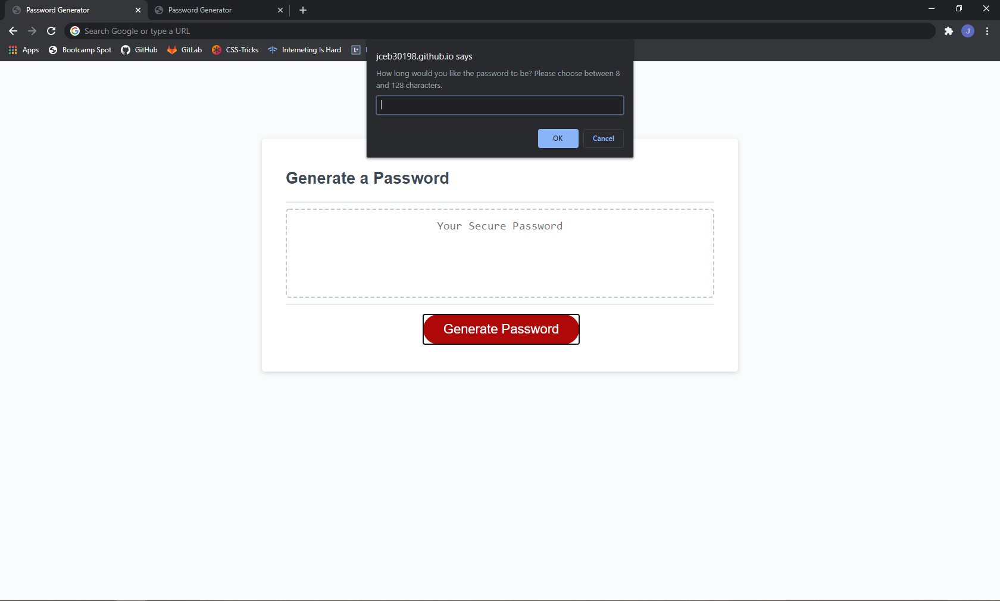
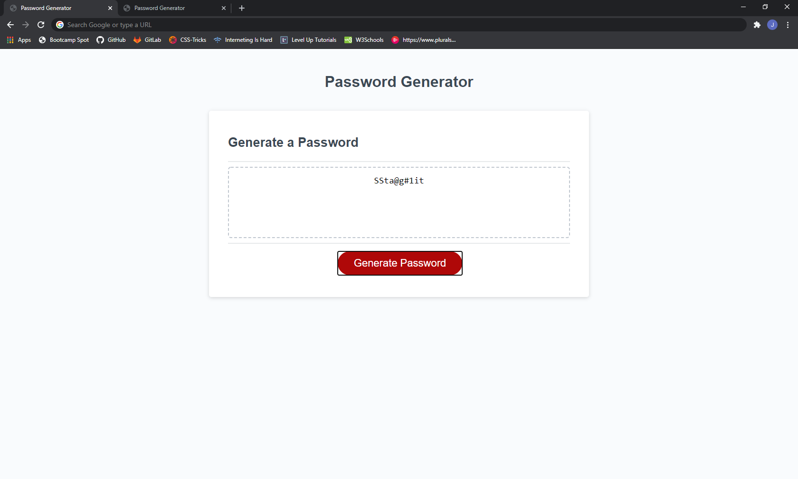

# Password_Generator

### Links:
- [Repository Link] (https://github.com/jceb30198/Password_Generator)
- [Program Link] (https://jceb30198.github.io/Password_Generator/)

## Program Features
- The languages used were: HTML, CSS, and JavaScript.
- The program creates a randomly generated password based on the answers to the prompts.
- When the button is clicked then the you will be asked a question with the prompt.
- The question determines the length of the password.

- A few prompts will pop up to ask you what you want in the password.
- Once the prompts are answered then the program will run through the arrays.
- Your randomly generated password will show in the text area.

